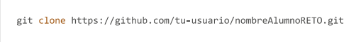

## Documentacion de la Aplicacion de Gestion Veterinaria
---
### Indice
- Documentacion de la Aplicacion de Gestion Veterinaria
    - [Indice](#indice)
    - [Introduccion](#introduccion)
    - [Instalacion](#instalacion)
    - [Uso](#uso)
    - [Contribucion](#contribucion)
    - [Subvencion](#subvencion)

### Introduccion
El sistema de gestion veterinaria desarrollado por el alumnado del **IES Miguel Herrero Pereda** permite a pacientes,medicos...

### Instalacion 

Para instalar y configurar la aplicacion en tu entorno local sigue los siguientes pasos:
  1. Clona el repositorio desde GitHub:
     
2. Abre el proyecto
3. compila y ejecuta

### Uso

funcionalidades principales:

- Solicitud y gestion de citas.
- acceso y consultas del historial
- Comunicacion entra pacientes y profesionales
- Gestion de recetas electronicas
- Administracion del personal
- Revision de informes
- Gestion de facturas

  A continuacion detalla las funciones de cada usuario:

  **Usuario**    **Funcionalidad**
  --
  Paciente         Solicita citas...
  --
  Veterinario      Gestiona citas...
  --
  Administrador    Administra personal...  

